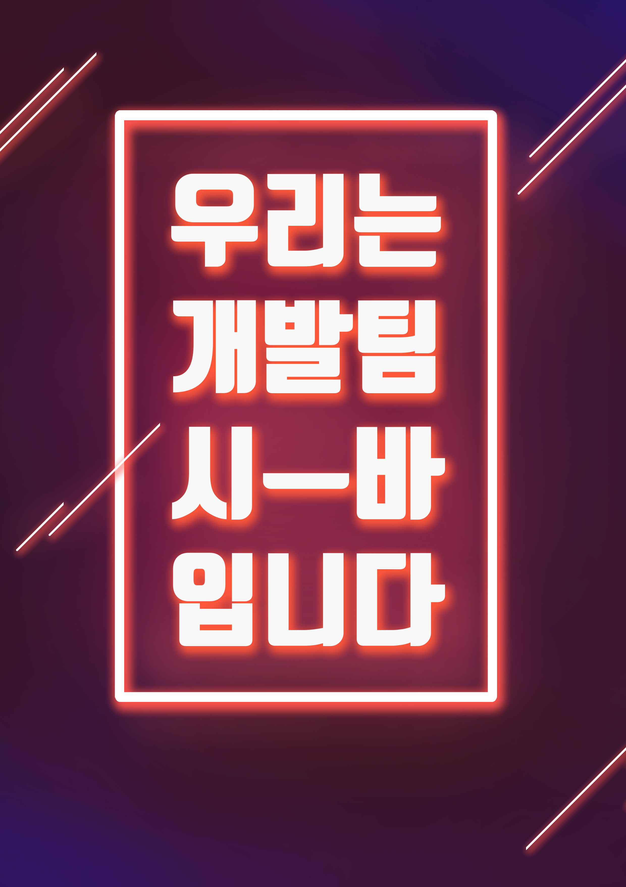
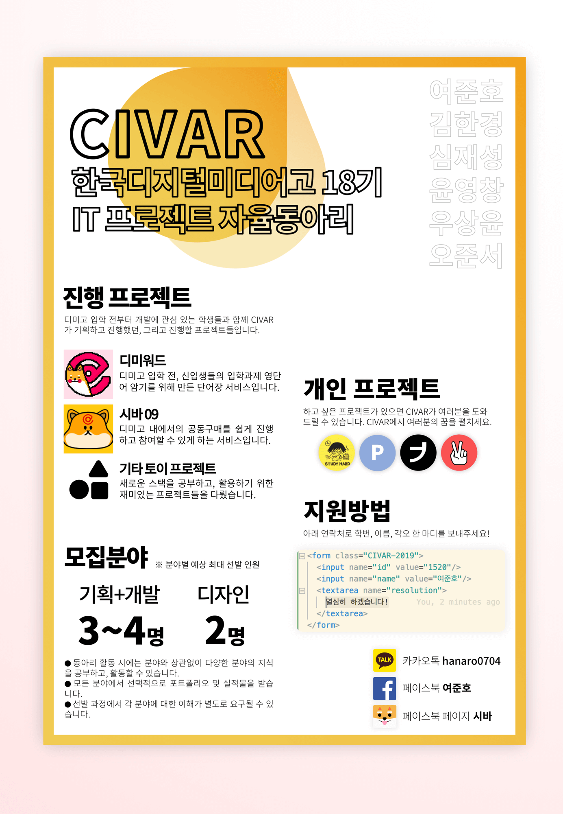

# INU 2019 🐕🕶️

입학 전부터 개발에 관심 있는 학생들이 모여 활동해 왔던 팀에서 이제는 자율 동아리로, 한국디지털미디어고등학교 18기 IT 프로젝트 동아리, INU(이누) 입니다.

## INU? 
CIVAR 개발팀의 새 이름이예요! 입학 전 활동, 그리고 자율동아리 모집 때 CIVAR라는 이름을 사용했지만 발음이 약간 부정적으로 들릴 수 있다는 점을 고려해서, 정식 자율동아리 이름은 INU(이누)로 결정했답니다 ><

## Why? 🤷

- 흔히 새로운 것을 가장 빨리 배우는 방법은 *일단, 직접 해보는 것*이라고 합니다. INU에서는 **여러 개인, 팀 프로젝트를 진행**하면서 개발과 디자인의 새로운 스택과 이론을 공부합니다.
- 특히 디미고 학생들부터 넓게는 이 세상에 기여할 수 있는, **누군가에게 도움을 줄 수 있는 IT 프로젝트**를 진행하는 것이 핵심 목표입니다.
- 다 함께 공부하고 연구해 개발한 실적물 그리고 경험을 이용해 각종 **해커톤 및 공모전 등의 대회에 참가**합니다.

## So what? 💭

1. 주변 학생, 학교부터 시작해서 넓게는 이 세상에 긍정적인 변화를 끌어낼 수 있는 프로젝트를 직접 기획하고 진행하기 때문에 그만큼 **주변의 문제 상황을 인식하고 개선하려고 하는 능력**을 향상시킬 수 있습니다. 
2. INU에서 경험할 수많은 의미있는 경험을 통해서 **IT 관련 능력에 대한 동기부여 효과 및 성취감**을 얻을 수 있습니다.
3. 급격히 변화하는 IT 기술을 **빠르게 습득하고 활용**할 줄 아는 능력을 얻을 수 있습니다. 단순히 구현이나 대회 입상을 목표로 하는 것이 아니라, 개발 분야의 경우 코딩 스타일과 재사용성 같은 코드 품질, 디자인 분야의 경우 UI와 UX에 대한 이해 등까지 신경 쓰며 활동하겠습니다. 이를 통해 실무 개발 역시 체험해 볼 수 있고, 현재 상태에 만족하지 않고 계속 **더 좋은 품질을 위해서 노력하고 발전하는 자세** 역시 가질 수 있을 것이라고 생각합니다.

## Members 👪
현재 INU 자율동아리의 공식 멤버 목록입니다!

- [1520 여준호(동장)](https://github.com/junhoyeo)
- [1210 김한경(부동장)](https://github.com/khg0)
- [1122 윤나린](https://github.com/Gamza13)
- ~~1202 권순우~~
- ~~1207 김수빈~~
- [1304 김상민](https://github.com/plantstoen)
- [1314 박승아](https://github.com/sseungah)
- [1317 심재성](https://github.com/Jaeseong-CS)
- [1320 윤영창](https://github.com/YunYeongChang)
- [1324 장종우](https://github.com/wkdwhddn06)
- [1409 민승현](https://github.com/MinSeungHyun)
- [1416 백은서](https://github.com/eunseo21)
- 1432 천예준
- [1515 송지호](https://github.com/Harugatto)
- [1522 우상윤](https://github.com/SYWoo2003)
- ~~[1530 장혁수](https://github.com/janghs0484)~~
- [1611 문형일](https://github.com/mhibio)
- [1618 오승주](https://github.com/ohboksa)
- ~~[1621 오준서](https://github.com/hunsol03)~~
