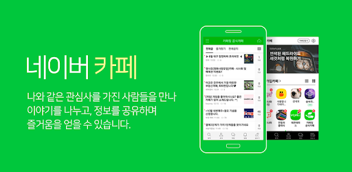
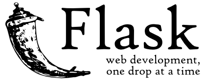
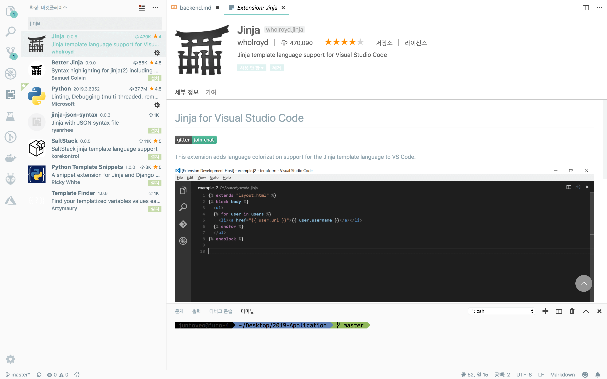

# INU 2019 백엔드 과제 ⚙️
- 먼저 [프론트엔드 과제](./frontend.md)를 한번 살펴보세요. 프론트엔드와 연동되어야 하는 게 바로 백엔드 API니까요.
- 역시 아래 수록된 모든 정보는 주노피셜입니다. 잘못된 정보가 있을 수 있으니 PR 넣어서 고쳐주세요.

## 백엔드가 뭐예요? 🤭


> 뒷부분을 담당하는 백엔드

사용자가 보지 못하는, 서비스 뒷부분에서의 처리를 백엔드라고 해요.
그러니까 다음과 같은 것들이 백엔드에 속할 거예요.

### 데이터베이스 관리 📊
사용자 계정 정보와 게시물, 활동 등 웹 서비스에서 사용하는 대부분의 정보는 여러분이 한번쯤 들어봤을 **데이터베이스(DB)** 라는 저장소에 저장됩니다. 

데이터베이스와 프론트엔드를 이어 줘서 사용자의 요청으로 DB 데이터를 생성하고, 수정하고, 삭제할 수 있도록 하는 것이 바로 백엔드가 하는 일이랍니다.

### 사용자 계정 관리 🔑
그렇기에 로그인, 로그아웃, 회원가입 등 역시 백엔드에서 다룬답니다.


> 한 예로 로그인은 어떻게 처리되는지 함께 알아볼까요?

사용자가 프론트엔드 앱에 입력한 정보를 서버의 정보와 비교해서 로그인을 처리하는 것입니다.

여러분이 아이디와 패스워드를 입력하면 백엔드는 해당 아이디를 가지는 사용자를 **데이터베이스에서 쿼리(질의)** 한답니다. 그 다음 입력받은 패스워드를 **해싱** 하고, 검색된 사용자의 해싱된 패스워드와 비교해서 맞으면 인증을 완료하고, 틀리면 로그인 에러로 처리하는 것입니다.

### 권한 확인 🔐


> 네이버 카페 서비스

우리가 신입생 때 사용했던 **네이버 카페** 서비스, 다들 기억하시죠? 아마 그 전에도 다들 커뮤니티 활동이나 정보 공유를 위해서 다들 많이 사용해 본 적이 있을 거예요.

카페에서는 카페 매니저(관리자), 카페 스탭(운영자) 그리고 여러 등급의 회원으로 사용자 등급이 나뉘어져 있어요.

보통 공지사항 게시판에는 권한이 일반 사용자보다 높은 카페스탭 이상의 회원만 새로운 게시글을 작성할 수 있게 되어 있잖아요? 만약 어떤 계정이던 게시물 생성이 가능하다면 새로 가입한 계정이 중요 공지 게시판에 불법 광고로 도배를 한다던가 하는 등, 난리가 날 거예요.

이렇게 사용자의 계정과 권한에 맞는 서비스를 제공하는 것 역시 백엔드가 처리해야 하는 일 중 하나랍니다.

# 📖 [1차 과제]
Flask와 Flask에 내장된 템플릿 엔진 Jinja를 사용해서 간단한 웹앱을 만들어 봅시다.

~~저 디미고인 때문에 조금씩 조금씩 추가할게요~~ 물론 제 1순위는 INU

## **참고자료**
꼭 한번씩 읽어보거나, 따라해 보세요!

일단은 아래 내용을 한번 훑어보고 가보세요! 사실 원래 이렇게 하면 안되는데, 제가 정리를 다 못해서요... 😥

- [Flask 공식 한국어 문서 - 빠르게 시작하기](https://flask-docs-kr.readthedocs.io/ko/latest/quickstart.html#quickstart)
  > 기본적인 `Hello World!` Flask 앱을 만드는 방법을 안내합니다. Flask 도큐먼테이션이 진짜 친절하게 설명이 되어 있어서 계속 읽고 공부하면 참 좋긴 하겠지만, 한국어 번역이 잘 된 것 같지는 않고 한국어 버전 css가 계속 깨져요(1년쯤 안 고치는 중). 부족하다 싶으면 [영어 문서](http://flask.pocoo.org/docs/1.0/quickstart/#a-minimal-application)도 보세요. 다행히 그렇게 어렵지도 않고 구글 써먹으면 금방 할거예요!

## Flask?


> 되게 오래되어 보이는 플라스크가 구석에 있는 Flask 로고

Python 기반의 웹 마이크로프레임워크입니다. 위에 있는 [빠르게 시작하기](https://flask-docs-kr.readthedocs.io/ko/latest/quickstart.html#quickstart)를 읽어 보셨다면 대충 감이 잡히시겠지만, 아래 5줄짜리 코드만으로 간단한 웹 서버를 만들 수 있답니다!

```py
from flask import Flask
app = Flask(__name__)

@app.route('/')
def index():
    return 'Hello, World!'

if __name__ == '__main__':
    app.run(debug=True, host='0.0.0.0', port=5000)
```

## Jinja?
Flask 안에 있는 템플릿 엔진이예요. 금방 감 잡을 거예요.

## VScode?
VScode는 완전 편한 텍스트 에디터입니다! 

Vscode를 이용하면 Flask 뿐만이 아니라 대부분의 프로그래밍 언어와 프레임워크 프로젝트에서 수월하게 작업이 가능하답니다.


> Jinja template language support for Visual Studio Code

Python 문법을 잡아주는 확장 프로그램은 기본으로 설치되어 있을 거예요. 대신, Jinja 문법을 하이라이팅(예쁘게 색칠)해주는 확장 프로그램을 설치하면 Flask에서 Jinja 템플릿을 다룰 때 편할 거랍니다.

# 📖 [2차 과제(*선택)]
Flask-Login, Flask-SQLAlchemy 같은 Flask 확장 모듈을 이용해서 보다 심화적인 기능을 넣어 봅시다.

## Flask extensions

# 📖 [3차 과제(*선택)]
API의 개념에 대해 알아보고, RESTful API와 JWT에 대해서 공부하고 정리하세요.

## API?

## RESTful API?

## JWT?
Json Web Token
