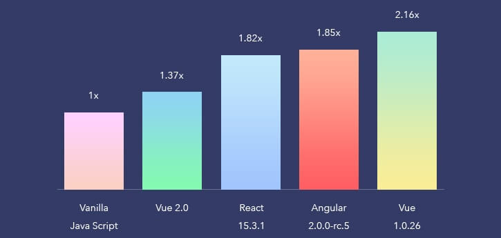

# INU 2019 프론트엔드 과제 🖼️
아래 수록된 모든 정보는 주노피셜입니다. 잘못된 정보가 있을 수 있으니 PR 넣어서 고쳐주세요.

## 프론트엔드란 무엇일까요? 🤔

> 사용자가 보는 부분을 처리하는 프론트엔드와 사용자가 보지 못하는 부분을 처리하는 백엔드

백엔드에서 필요한 데이터를 주고받는 프론트엔드는 사용자가 직접 조작하고, 보는 부분을 담당합니다. 

예를 들어서 메신저 웹 서비스의 프론트엔드 앱에서는 서버(백엔드)에서 사용자가 이전에 나눈 대화 데이터를 받아와 뿌려주고, 사용자에게 다음으로 보낼 메세지를 입력받아 서버로 전송합니다.

## Vue.js 🌴
INU 여러분들에게 제가 추천하고 싶은 프론트엔드 프레임워크는 [Vue.js](https://kr.vuejs.org/)입니다.

> Vue 만세!

여러분의 대부분이 이미 알고 있겠지만, 오늘날 거의 대부분의 웹페이지에서 자바스크립트가 사용됩니다. 사용자의 브라우저에서 실행되는 자바스크립트로 우리는 더 아름답고 다양한 기능을 사용할 수 있는 것이죠.

그런데, 그냥 자바스크립트 코드를 쓰는 것만으로는 빠른 시간 동안 웹 개발을 하기 어려웠답니다. ~~혹시라도 node를 사용하지 않고 jquery 등을 이용해서 노가다를 해본 친구가 있다면 알 거예요.~~

겹치는 코드는 서로 모듈로 분리하고, 모듈과 모듈을 이어서 효율적으로, 더 편하게 패키지를 관리하는 것은 어떨까요? 

그렇게 체계적으로 프론트엔드 프로젝트를 관리하기 위해서 **프론트엔드 프레임워크**라는 게 나왔어요.

Vue.js는 그런 프론트엔드 프레임워크 중 하나예요!

## 이걸로 뭘 할 수 있죠? 🍎

> Vue.js로 만들어진 디미고 인트라넷, 디미고인

Vue.js로는 간단한 프로젝트부터 많은 사람들이 이용하는 커다란 서비스까지, 생각보다 많은 것을 할 수 있답니다. 

우리 학교의 인트라넷인 [디미고인](https://dimigo.in/) 그리고 [디미고 라이프](https://dimigo.life) 역시 Vue.js를 이용한답니다.

## 과제가 뭔가요? 💻
4월 8일(월요일)까지 Vue.js를 이용해서 자유 주제로 웹 앱을 만드시면 됩니다! 

- 여러분의 학습 능력을 알아보고 함께 더 발전하기 위해서 만든 과제입니다. 자바스크립트의 문법에 대해서 모르더라도, Vue.js가 무엇인지 모르더라도 구글링(검색)으로 나오는 많은 자료들을 참고해서 **최대한** 진행해주세요.

- 과제는 git을 사용해서 버전관리를 해주시면 좋겠어요. 
  - 예전에 시바 개발팀 시절 만들었던 [Git과 Github 강의](https://github.com/INU18/Today-We-Learned/blob/master/001.%20Github)가 있긴 한데, 아마 읽어보시면 어디서 시작해야 할지 약간 감은 잡으실 수 있을 거예요. 
  - Github 계정이 없으신 분은 꼭 만들어서 자기 아이디로 새로운 저장소를 만들어서 거기에 올려주시면 됩니다.
  - 혹시라도 여기까지 진행하시는 게 어려우시다면, 가능한 데까지만 최대한 해주시면 됩니다!

## 이걸 저보고 하라고요? 😡
네, 충분히 가능합니다!

- 여러분에게는 Google이 있답니다! 아마 지금 여러분이 맞닥뜨릴 궁금증과 에러는, 이미 저 세계 반대편의 누군가가 이미 한번쯤 만나 봤던 거예요. 그렇기 때문에 구글링을 하다 보면 Stack Overflow 등의 훌륭한 사이트에서 그 답을 쉽게 찾을 수 있을 거예요.
  
- [Vue CLI 3.0 사용하기](http://vuejs.kr/vue/vue-cli/2018/01/27/vue-cli-3/): Vue CLI 3.0과 NPM 또는 yarn을 이용해서 프로젝트를 만드시는 걸 권장합니다. 
  
- 이전 버전의 Vue CLI를 다루고 있긴 하지만, [이런 블로그 강의](https://beomy.tistory.com/39) 등을 참고하시는 것도 추천드릴게요(아마 한국어 강의의 대부분이 Vue CLI의 이전 버전을 이용해서 다루고 있어요).
  
- 모르는 게 있으면 그때그때 직접 검색해서 문제를 해결해 보세요.
  
- INU 단체 톡방에 올려서 다함께 문제를 공유하고 해결하는 것 역시 도움이 될 거예요.

- 그리고 [Github](https://github.com)에 많이 있는 다양한 프로젝트의 코드를 참고하는 것도 도움이 많이 될 거랍니다!

감사합니다! 여러분의 과제는 제가 틈틈히 리뷰하고 도와드릴 수 있도록 노력하겠습니다. Github 저장소를 만들고 나면, 제게 링크를 보내주세요!
